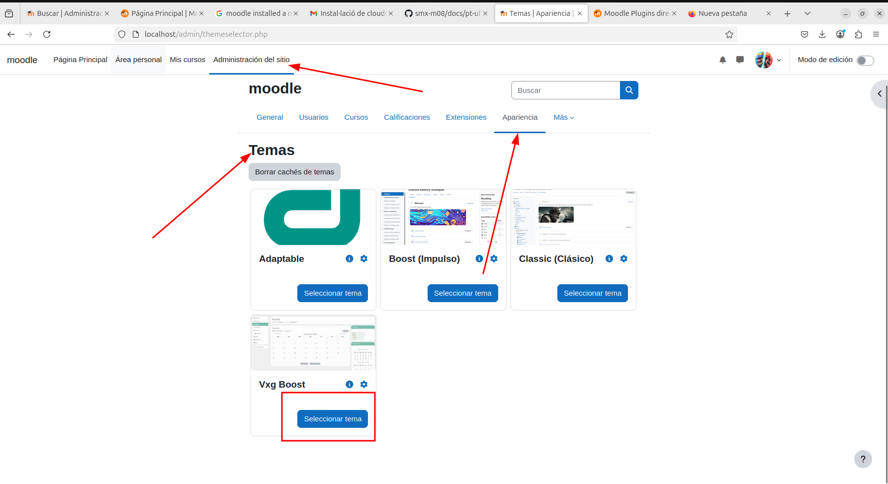

# Configuración

## Ajustes generales

### 1. Iniciar sesión  .

Primero de todo iniciaremos sesión en el moodle con nuestro usuario y contraseña. Los primeros pasos seran cambiar nuestra foto de perfil, nuestro correo y nuestra contraseña.
Para ello entraremos en nuestro icono de perfil y nos saldra un boton llamado "Perfil" ahi podremos editar nuestras cosas a nuestro gusto. Debera de quedar asi:

### 2. Idioma 

Ahora haremos el cambio de idioma, para ello deberemos entrar en la administración del sitio webl, ir al apartado idioma y entrar en la pestaña parametros. Una vez alli cambiamos la pestaña donde nos sale idioma. Si no sale deberas instalarlo en el apartado paquetes de idioma.

### 3. Contraseñas 

Para el tercer paso deberemos cambiar la contraseña de nuestro portal. Añadiendo que como minimo tenga 4 letras, que haya una mayuscula y algun numero. Esto se hace desde administración, vamos al apartado de seguiridad y a las normativas del sitio.

En la siguiente imagen se vera donde debemos poner los parametros para conseguir lo que necesitamos 

## Gestión de cursos

### Creación de cursos

Primero empezaremos creando el curso A, donde deberemos ponerle tres temas. Que esto se hace desde administración del sitio, en el apartado cursos y categorias o desde Navegación, en el apartado cursos y haciendo clic en añadir curso.

Después de haberlo creado, para añadir los temas dentro de curso nos saldra una pestaña donde pondra añadir temario o tareas. desde ahi añadimos los temas que necesitemos (en este caso 3) y deberia quedar asi.

 

Para el curso B haremos los mismos pasos que con con el pero en el momento de añadir temas en vez de 3 añadiremos 5. 

### Añadir material al curso

Para esto deberemos entrar en los temas previamente creados y hacer lo mismo que para crear los temas. Vamos al apartado de añadir dentro del tema seleccionado y nos saldra un menú

Y aqui añadimos lo que queramos. 

Finalmente deberia verse asi.

## usuarios y alumnos

### Creación del primer usuario

Crearemos al alumno Bob. Esto lo podemos hacer en la administriación, en la pesatña usuarios, yendo a cuentas y a añadir usuario.

Desde alli nos saldra una serie de pasos que completar con la inforamción, contraseña y mas cosas para añadir al usuario. 

Cuando este añadido debera de quedar asi.

### Creación 10 alumnos (CSV)

Para crear 10 alumnos de manera inmediata, deberemos hacerlo desde un archivo CSV. 
Esto se indica de la siguiente manera, cogemos el archivo, ponemos que estructura queremos y completamos la estructura con los alumnos que queramos añadir.

Nuestra estructura sera nombre de usuario, primero nombre, apellido, correo electronico y contraseña

Seguidamente cargamos el archivo, yendo a administración - Usuarios - Cuentas - Añadir usuarios. Cargamos nuestro archivo y quedara así.

### Borrar un usuario

Esta tarea es bastante sencilla, pero iremos paso a paso.

Entraremos en la sección de usuarios desde la administración del sitio. Donde nos saldran los 10 usuarios. Seleccionamos el usuario que queremos borrar.

Seguidamente haremos clic en los tres puntos que salen al final del nombre del usuario seleccionado y nos saldra un recuadro con la opción de borrar. Hacemos clic en "Borrar".

Finalmente, saldra una confirmación de si estamos seguros de ejecutar la acción. Confirmamos y el usuario sera borrado.

## Matriculación y configuración de cursos

### 5. Matrícula y permisos en cursos

#### Configuración de métodos de inscripción

Para el curso A, desactivamos todas las inscripciones para que el acceso sea libre como visitante. Esto lo hacemos entrando a:

Administración del curso > Usuarios > Métodos de inscripción  
Desactivamos todos los métodos excepto Acceso como invitado y activamos la opción de entrada sin contraseña.

Para el curso B, habilitamos solo la inscripción manual. Así, solo nosotros como administradores podremos inscribir usuarios.

#### Asignar roles

Asignamos a Bob como profesor del curso B entrando a:  
Administración del curso - Usuarios inscritos - Inscribir usuarios  
Buscamos a Bob y le asignamos el rol de Profesor.

Luego cargamos el archivo CSV con los 10 alumnos y los inscribimos manualmente al curso B con el rol de Estudiante.

Y despues de este paso selecionamos a los alumnos que queremos añdir y hacemos clic en "Añadir"

#### Comprobación del acceso

Entramos como visitante y comprobamos que el curso A se puede visualizar sin iniciar sesión. Como hemos visto anteriormente pero desdel punto de vista de un alumno.

Después, intentamos entrar al curso B sin iniciar sesión y Moodle nos pedirá autenticación.

### 6. Apariencia del sitio

Entramos a:  
Administración del sitio - Plugins - Instalar complemento 
Subimos el archivo `.zip` del nuevo tema descargado desde el sitio oficial de Moodle.

Una vez instalado, vamos a:  
Administración del sitio - Apariencia - Temas - Selector de temas  
Y seleccionamos el nuevo tema.

(En este paso mi moodle no podia cargar los temas, por ello la imagen solo muestra como hacerlo y no el resultado final.)

### 7. Asignar profesor y alumnos al curso A

Asignamos un nuevo profesor al curso A repitiendo el proceso de inscripción manual desde:  
Administración del curso - Usuarios inscritos - Inscribir usuarios

Luego añadimos manualmente a los alumnos (pueden ser los mismos del CSV o nuevos).

### 8. Añadir contenido desde el rol de profesor

Iniciamos sesión como el profesor asignado al curso A y activamos la edición.  
Agregamos actividades desde los temas ya creados.

Creamos una Tarea que permita subir un archivo PDF con una fecha de entrega abierta:

- Tipo de entrega: Subida de archivos
- Formato permitido: PDF
- Fecha de entrega: configurada manualmente

Seguidamente seguimos los pasos que nos piden de añadir un nombre y diferentes cosas.

### 9. Entregar tarea como alumno

Entramos con un alumno registrado, accedemos al curso A y seleccionamos la tarea creada.  
Subimos un archivo PDF desde el botón "Agregar entrega".

Una vez entregado, se muestra la confirmación de entrega y el botón para modificar si es necesario.

